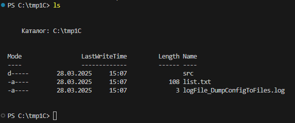
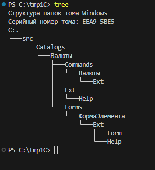

# unloading_metadata_1C_into_files_DumpConfigToFiles

Батник для выгрузки файлов метаданных объектов конфигурации файловой базы по списку объектов из файловой базы.

Переменные в bat:

    version1C - Версия платформы 1С
    userName - Имя пользователя 1С
    userpassword - Пароль пользователя 1С
    localPathВase - Путь к папке с файловой базой;
    localPathApp - Рабочая папка для батника.
    nameListFile - имя файла со списком выгружаемых объектов, каждый объект выводить с новой строки. Пример содержимого файла:
        Справочник.Валюты
        Справочник.Валюты.Форма.ФормаЭлемента

Пример расположения папок и файлов в рабочей папке батника:

Пример структуры папок после работы батника:

